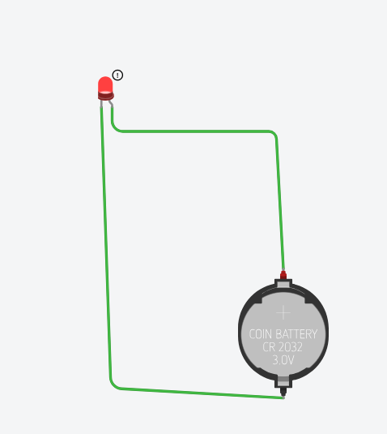

**Greeting Card Lamp:**  
                  
Description:  
                   \~  We really happy to convey our birthday wishes through our fascinated greeting card,we wish that yours birthday day will go well and new journey will starts with wonderful moments…..

Required Components:  
                  \~Coin cell  
                  \~Glue  
                  \~Aluminium foil  
     \~LED Light(Red)  
     \~Colour Paper  
     \~Scissor  
 Procedure:

                  \~  Fold a colour Paper into greeting card  
                  \~ Draw and cut the paper in heart shape and place on greeting card towards centre.  
                  \~ Make a small hole where you want the led to shine.  
                  \~  Insert the led into the hole.  
                  \~ Place the coil battery between the led legs.  
                  \~ Use a folded colour paper as an on\\off switch.  
                  \~ Open the switch / flap\~led glows.

  Functions :  
                                          
               \~The working model of the birthday greeting card is ,when the aluminium foil fold is removed ,the aluminium foil goes towards positive foill and the led red light blinks.  
![][image1]![][image2]

